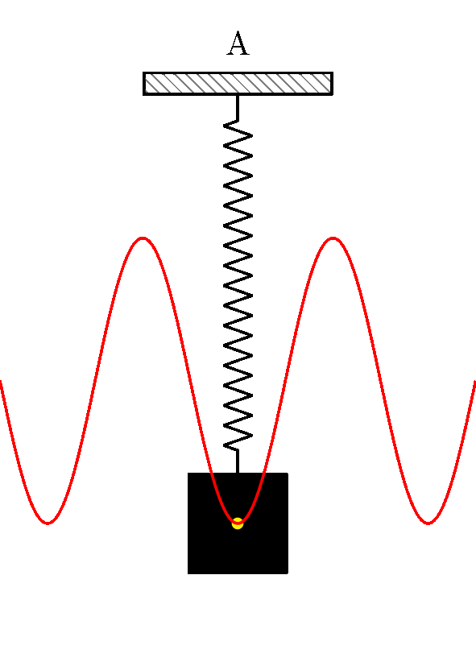

```bash
sudo apt install texlive-pstricks
```

Compile `.tex` to get pdf. then convert it into animation using `imagemagick`

```bash
mkdir frames
convert -density 300 -background white *.pdf frames/frame_%03d.png
convert -delay 10 -loop 0 frames/frame_*.png animation.gif
# or
ffmpeg -framerate 10 -i frames/frame_%03d.png -c:v libx264 -pix_fmt yuv420p animation.mp4
```


